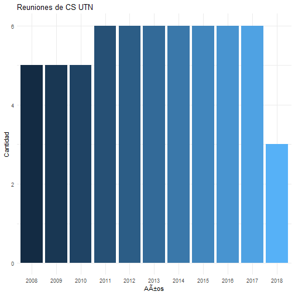

 

 
## Actas de reuniones del Consejo Superior de UTN
En este post trataremos de reproducir el trabajo realizado por .
 
En este caso hemos tomado lactas de reuniones del Consejo Superior de los 칰ltimos 10 a침os.
Los paquetes necesarios ser치n: NLP, openNLP y magrittr
En primer lugar ejecutamos la funci칩n para extraer el texto de las actas, actualmente almacenadas en archivos .pdf. Ese post se puede ver en: ENLACE

 
En esta oportunidad s칩lo importamos el archivo .csv generado:


  actas_CS <-   read.csv("data\\actas.csv", 
                          sep="\t", stringsAsFactors=FALSE, 
                          encoding="latin1" )
  names(actas_CS) <- c("archivo","anio", "nro", "reunion", "lugar", "txt")

 
### Cantidad de Reuniones por A침o
En primer lugar analizaremos cuantas actas por a침o se recuperaron, que ser칤a equivalente a la cantidad de reuniones llevadas a cabo


  reuniones <- actas_CS[actas_CS$anio != "2005" & 
                        actas_CS$anio != "3.pd" & 
                        actas_CS$anio != "AU20" & 
                        !is.na(actas_CS$anio),] %>% 
              count(anio, reunion, sort = TRUE) %>% 
              group_by(anio)
 
  anios <- as.data.frame(reuniones$anio, reuniones$reunion)
  names(anios)<-"anio"
 
  Freuniones<- ggplot(anios, aes(x=as.factor(anios$anio), 
      fill = as.numeric(anios$anio))) + 
    geom_bar(position='dodge', show.legend = FALSE) + 
    xlab("A絪") + 
    ylab("Cantidad") + 
    scale_x_discrete("A絪s" ) + 
    theme_minimal() +
    ggtitle("Reuniones de CS UTN")

### El gr치fico de frecuencias de reuniones por a침o:

 
